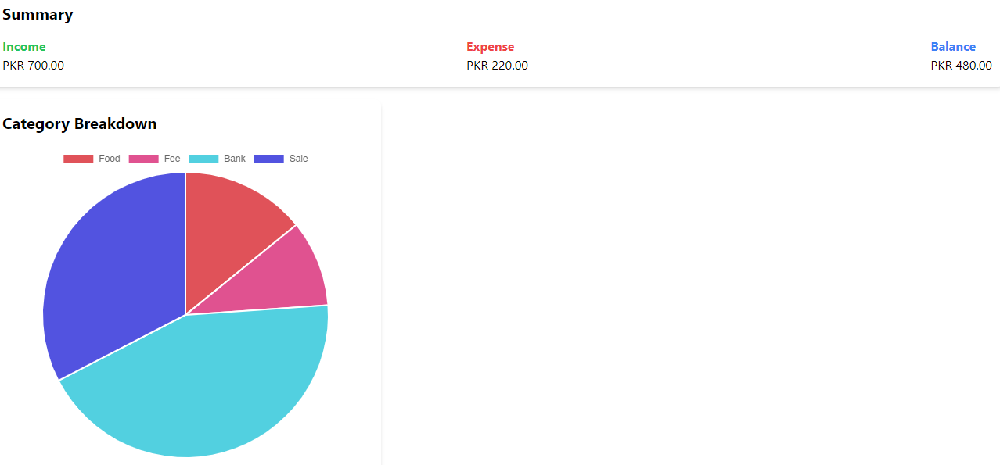

## Anas Budget Tracker App

Developed a budget tracker with categorized transactions, dynamic data visualization, and responsive design.
Enabled CRUD operations for managing expenses and income with real-time updates and scalable architecture.

## What I Used
- React Js
- Javascript
- Tailwind CSS
- axios
- chartJs
- MongoDB
- Express Js
- Node Js
- mongoose

## Basic Knowledge
- React Js
- HTML, CSS, Javascript

## Screen Shots of Web App

